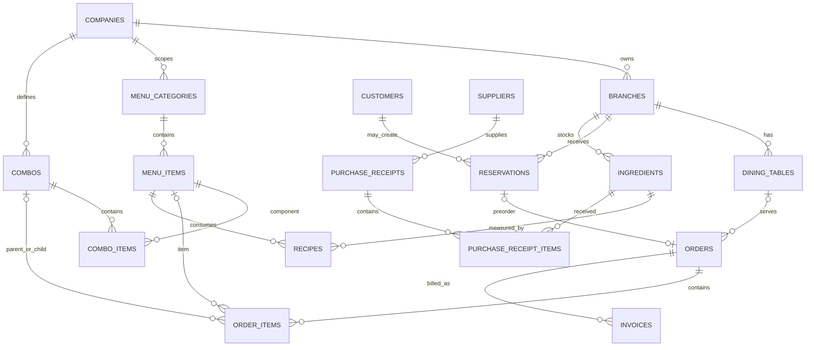

# Logical ERD

This is a concise logical view of the current application paths, not proof that a target database has every migration applied.

Combo order representation is intentionally denormalized into `order_items`: one `is_combo_parent = true` row carries combo price, while child rows carry kitchen work with zero price until detached. Migration `032_order_combo_support.sql` adds this representation; `033_repair_detached_combo_prices.sql` repairs a specific historical detached-child condition.

Migration history is not a canonical ERD migration chain: combo tables are created/dropped/recreated across `003_combo_verify_audit.sql`, `016_drop_combo.sql`, `017_recreate_combos.sql` and `028_drop_combos.sql`. Validate the target snapshot before applying SQL.
